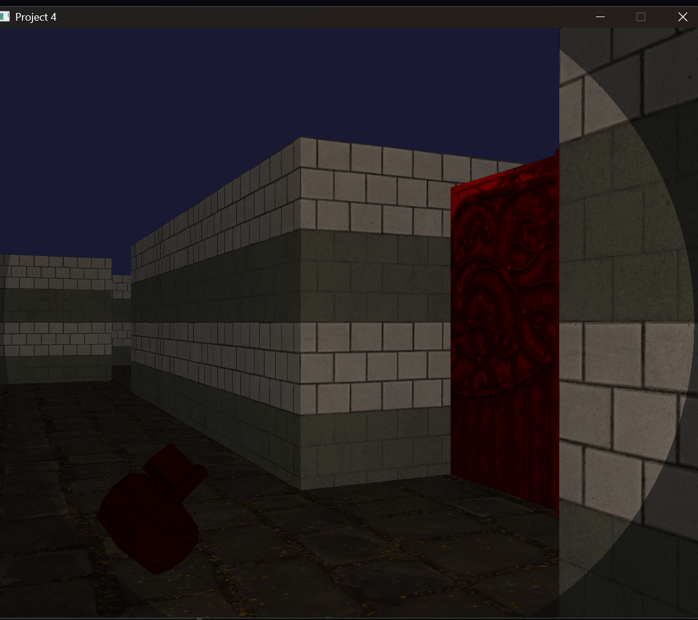

# 3D Maze Engine (OpenGL)

This project is a small 3D maze-style game built in C++ with OpenGL and SDL3. It combines simple engine systems such as scene loading, OBJ model loading, texture mapping, camera movement, collision handling, and interactive gameplay elements like keys, doors, and level progression.

## Overview

This project builds on earlier graphics coursework and expands it into a more complete interactive 3D environment.

The engine loads map data from text files, renders the level in 3D, loads external OBJ models, applies textures, and allows the player to move through the scene while collecting keys, opening gates, and reaching the goal.

## Features

- 3D level loading from `.txt` map files
- Custom parser for grid-based maps
- OBJ model loading
- Texture mapping with `stb_image`
- UV scaling for repeated floor textures
- First-person style movement
- Collision handling
- Key and door system
- Multiple levels
- Goal / level completion logic
- Flashlight-style lighting
- Jumping

## Example Output

### Gameplay


### Level View


## Controls

- `W` / `A` / `S` / `D` - move
- `Left Arrow` / `Right Arrow` - rotate
- `Space` - jump
- `Esc` - quit

## How It Works

The project uses a grid-based map where different characters represent walls, keys, doors, and goal objects.

At runtime, the program:

1. Loads the current level from a text map file
2. Builds the scene from map tiles
3. Loads 3D OBJ models for keys, gates, and goal objects
4. Applies textures to walls, floor, and objects
5. Updates camera movement and collision
6. Checks interactions such as picking up keys and unlocking doors
7. Advances to the next level when the goal is reached

## Build

Compile from the project root directory.

### Windows (MinGW g++)
```bash
g++ -std=c++11 main.cpp glad/glad.c -I"C:/libs/SDL3/include" -L"C:/libs/SDL3/lib/x64" -lSDL3 -lOpenGL32 -o maze_engine.exe
```

## Run

```bash
.\maze_engine.exe
```

## Main Files

- `main.cpp` - main rendering, gameplay, and level logic
- `glad/` - OpenGL function loader
- `glm/` - math library for matrices and vectors
- `models/` - map files, OBJ models, and textures
- `stb_image.h` - image loading for textures

## Challenges

Some of the main challenges in this project included:

- Implementing a custom OBJ loader
- Correctly loading and scaling imported models
- Handling collision so the camera does not clip into walls
- Fixing stretched textures on large surfaces
- Managing level progression, doors, and keys cleanly
- Balancing simple gameplay logic with rendering code

## Notes

- Build from the project root so all relative paths to `models/` work correctly
- The project expects SDL3 to be installed locally
- `glm` is header-only, so no additional linking is needed
- This is a source-code project; compiled binaries do not need to be committed to the repository

## Context

Built as part of a Computer Graphics course project, this work expands earlier assignments into a more complete interactive 3D environment with custom loading, movement, and gameplay systems.