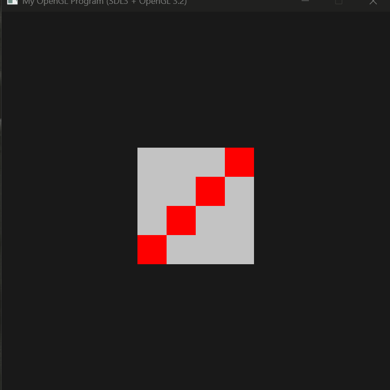
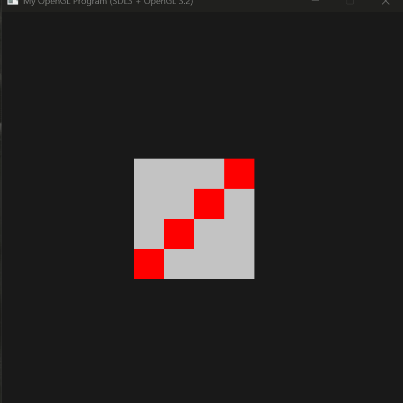

# Interactive Textured Square (OpenGL)

This project demonstrates an interactive square built with OpenGL, supporting real-time transformations and texture mapping.

## Features

* Scaling using mouse drag
* Rotation using mouse interaction
* Texture mapping (switch between textures)
* Brightness control
* Animation toggle

## Demo

  
  
  

## Controls

* Drag corners → scale
* Drag edges → rotate
* `B` → increase brightness
* `A` → toggle animation
* `T` → switch texture

## Tech

* C++
* OpenGL
* SDL

## Notes

Built as part of a Computer Graphics course, focusing on transformations and interactive rendering.
