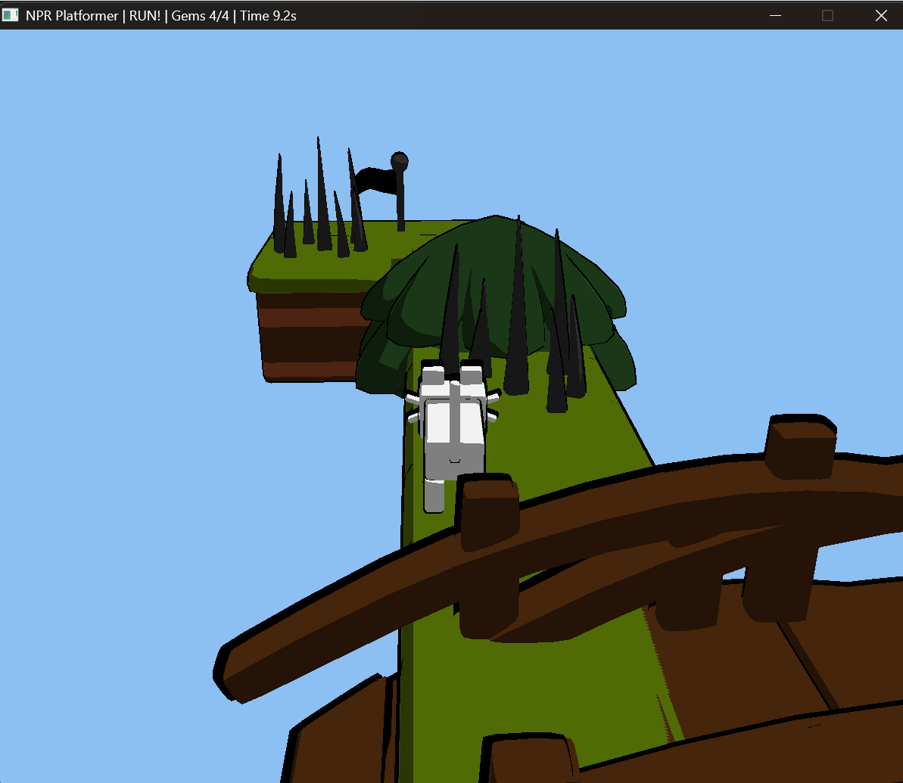

# Platform Ink: NPR Platformer

This project is a third-person 3D platformer built in C++ with OpenGL and SDL3. It combines a playable platforming game loop with a stylized non-photorealistic rendering (NPR) pipeline, focusing on toon shading, outlines, and a cartoon-like visual style.

## Overview

The goal of this project was to build more than a static rendered scene. Instead, I developed a small playable “mini-engine” where the player can move, jump, collect gems, avoid hazards, and progress through multiple levels.

The final system includes:

- A third-person orbit camera
- Grid-based, data-driven level loading
- Collectible objectives
- Hazard and lose conditions
- Automatic level transitions
- Toon / cel shading
- Rim lighting
- Inverted-hull outlines

This project extends my earlier graphics work into a more complete interactive game system.

## Core Gameplay

The player controls a character in a third-person 3D environment.

The main gameplay loop is:

1. Explore the level
2. Collect all gems
3. Avoid hazards such as spikes
4. Reach the exit flag after collecting every gem
5. Automatically advance to the next level

The game also includes a timer, failure conditions, and level resets.

## NPR / Rendering Features

A major focus of this project is stylized rendering.

### Toon Shading
The lighting is quantized into discrete bands using a ramp texture, producing a flat cartoon-like appearance instead of realistic smooth shading.

### Rim Lighting
Rim lighting is added using the relationship between the view direction and surface normal, helping silhouettes stand out and improving shape readability.

### Outline Rendering
Objects are rendered with an inverted-hull outline pass by drawing a slightly scaled black version of the mesh behind the main object. This creates a clean cartoon outline around characters and objects.

### Vertex Color Pipeline
Instead of relying only on textures, this project reads diffuse color (`Kd`) values from MTL files and bakes them into vertex attributes. This allows low-poly assets to preserve their intended color palettes while working well with the NPR shader pipeline.

## Engine / System Features

- Third-person smooth orbit camera
- Camera-relative movement
- Jumping and gravity
- Lightweight AABB-style ground collision
- Data-driven level loading from text files
- Dynamic gem counting and win condition setup
- Time limit scaling based on level size
- Multi-level support with automatic transitions
- Proximity-based collectible logic
- Hazard detection
- Animated collectibles (hovering + rotation)

## How It Works

Levels are loaded from external text files. Each character in the ASCII map corresponds to a gameplay element, such as:

- Solid platforms
- Bridges / fences
- Spikes
- Gems
- Exit flag

At runtime, the engine:

1. Parses the level file
2. Spawns world objects based on the map grid
3. Counts gems to determine the required collect target
4. Updates player movement and collision
5. Checks hazards, win conditions, and timer logic
6. Loads the next level when the exit is reached

This makes the game system flexible and easy to extend without hardcoding geometry directly in C++.

## Example Media

### Gameplay

<div align="center">


</div
<br>
<br>
### Level View


## Controls

- `W` / `A` / `S` / `D` - move relative to camera direction
- Mouse - control third-person camera
- `Space` - jump
- `Esc` - quit

## Build

This project uses the same general setup as my earlier OpenGL coursework and depends on SDL3, OpenGL, GLAD, and GLM.

### Windows (MinGW g++)
```bash
g++ -std=c++11 main.cpp glad/glad.c -I"C:/libs/SDL3/include" -L"C:/libs/SDL3/lib/x64" -lSDL3 -lOpenGL32 -o platform_ink.exe
```

## Run

```bash
.\platform_ink.exe
```


## Main Technical Challenges

Some of the biggest challenges in this project were:

- Keeping gameplay coordinates consistent with imported OBJ assets
- Handling mismatch between visual meshes and grid-based gameplay logic
- Building stable ground collision for platforming without a full physics engine
- Managing different model origins (centered vs bottom-aligned)
- Preventing ground snapping and overlap edge cases
- Integrating stylized rendering into a real playable loop instead of a static demo

To make collision more stable, I implemented a simple AABB-style ground collision system that checks overlap with solid tiles and determines the best valid top surface beneath the player.

## Connection to Course Topics

This project connects directly to major topics from the course, especially:

- Non-photorealistic rendering (toon shading, outlines, rim light)
- Shader-based rendering pipelines
- Lighting models
- Time-based procedural animation
- Material handling through vertex attributes
- Interactive rendering systems
- Game-style scene management

It also expands the earlier Project 4 framework into a more complete interactive system.

## Resources Used

- **C++**
- **SDL3** for windowing, input, and OpenGL context creation
- **OpenGL 3.2 core profile**
- **GLSL shaders**
- **GLAD**
- **GLM**
- **stb_image**
- **Ultimate Platformer Pack by Quaternius** for art assets
- Custom OBJ / MTL parsing logic for loading geometry and diffuse color data

## Future Improvements

There are several clear next steps for improving this project:

- More robust collision handling
- Camera obstacle avoidance
- Better shadow support
- More advanced toon ramp variations
- Sound effects
- Particle effects
- HUD / on-screen UI
- Better separation between engine systems and gameplay code

## Notes

- Build from the project root so all relative paths resolve correctly
- This is a source-code project; compiled binaries do not need to be committed
- The current collision system is intentionally lightweight and focused on stable platforming rather than full physics simulation

## Context

Built as a final project for CSCI 5607 (Computer Graphics), this project brings together stylized NPR rendering, shader work, animation, level parsing, and gameplay systems in a complete playable 3D platformer.