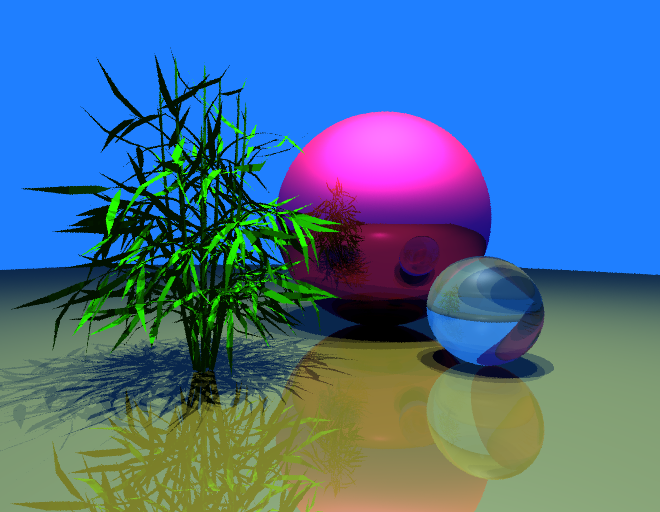
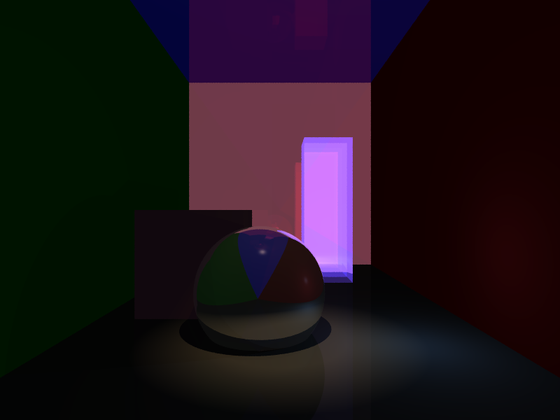
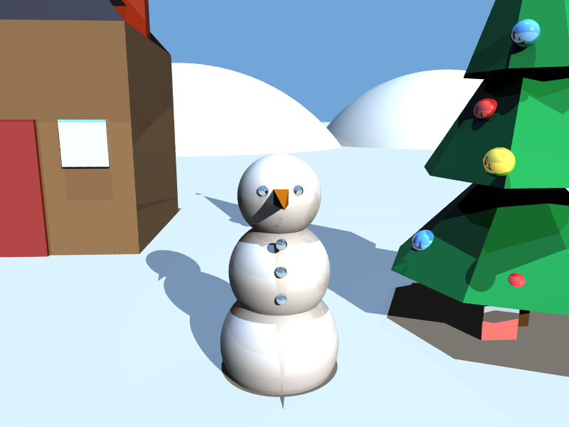
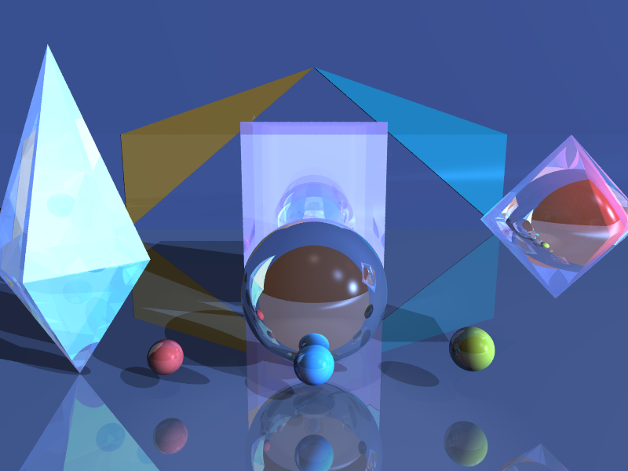

# Ray Tracer (Advanced)

This project is an advanced version of my earlier basic ray tracer. It builds on the same core ray tracing pipeline, but extends it with more geometry types, more lighting features, recursive effects, anti-aliasing, and parallel rendering.

## Improvements Over the Basic Version

Compared to the basic ray tracer, this version adds:

- Multiple random rays per pixel (jittered supersampling)
- Reflection
- Refraction
- Spot lights
- Additional geometry:
  - Planes
  - Boxes
  - Triangles
- Smooth shading for triangles using interpolated normals
- Parallelized rendering using OpenMP

## Features

- Ray-object intersection
- Sphere rendering
- Plane intersection
- Box intersection
- Triangle intersection
- Phong shading
  - Ambient
  - Diffuse
  - Specular
- Point lights
- Directional lights
- Spot lights
- Shadow rays
- Recursive reflections
- Recursive refractions
- Jittered anti-aliasing
- Scene parsing from `.txt` files
- Image output
- OpenMP parallel rendering

## Example Output

<div align="center">

  
</div
<br>
<br>

<div align="center">


</div

## How It Works

For each pixel, the program:

1. Casts one or more rays from the camera into the scene
2. Finds the closest valid intersection
3. Computes local illumination using the Phong model
4. Casts shadow rays to test visibility to light sources
5. Recursively traces reflection rays
6. Recursively traces refraction rays
7. Averages multiple samples per pixel for anti-aliasing
8. Writes the final image to disk

## Build

Because this version uses OpenMP for parallel rendering, compile with the OpenMP flag.

### Mac / Linux / WSL
```bash
g++ -std=c++11 -fopenmp rayTrace.cpp -o raytracer
```

### Windows (MinGW g++)
```bash
g++ -std=c++11 -fopenmp rayTrace.cpp -o raytracer.exe
```

## Run

Run the program by passing a scene file.

### Mac / Linux / WSL
```bash
./raytracer /texts/bottle.txt
```

### Windows
```bash
.\raytracer.exe /texts/bottle.txt
```

## Main Files

- `rayTrace.cpp` - main advanced ray tracing implementation
- `headers/vec3.h` - vector math utilities
- `headers/parse_vec3.h` - scene file parsing
- `headers/scene_structs.h` - scene data structures
- `headers/image_lib.h` - image handling helpers
- `headers/stb_image.h`, `headers/stb_image_write.h` - image loading and writing utilities

## Notes

- Compile from the project root so the `headers/` includes resolve correctly
- The program expects exactly one scene file argument
- Output image names are typically defined by the parsed scene file
- Rendering time depends on scene complexity, recursion depth, and sample count
- Anti-aliasing and recursive effects increase render time but improve image quality

## Challenges

Some of the main challenges in this version included:

- Extending the renderer from spheres to multiple geometry types
- Handling smooth vs flat shading for triangles
- Fixing shadow acne by offsetting shadow rays slightly from the surface
- Debugging camera and vertex issues in more complex scenes
- Keeping recursive reflection and refraction stable
- Improving performance while adding more expensive rendering features

## Context

Built as part of a Computer Graphics course project, this version expands the original basic ray tracer into a more advanced rendering system with improved realism, more geometric support, and better image quality.
