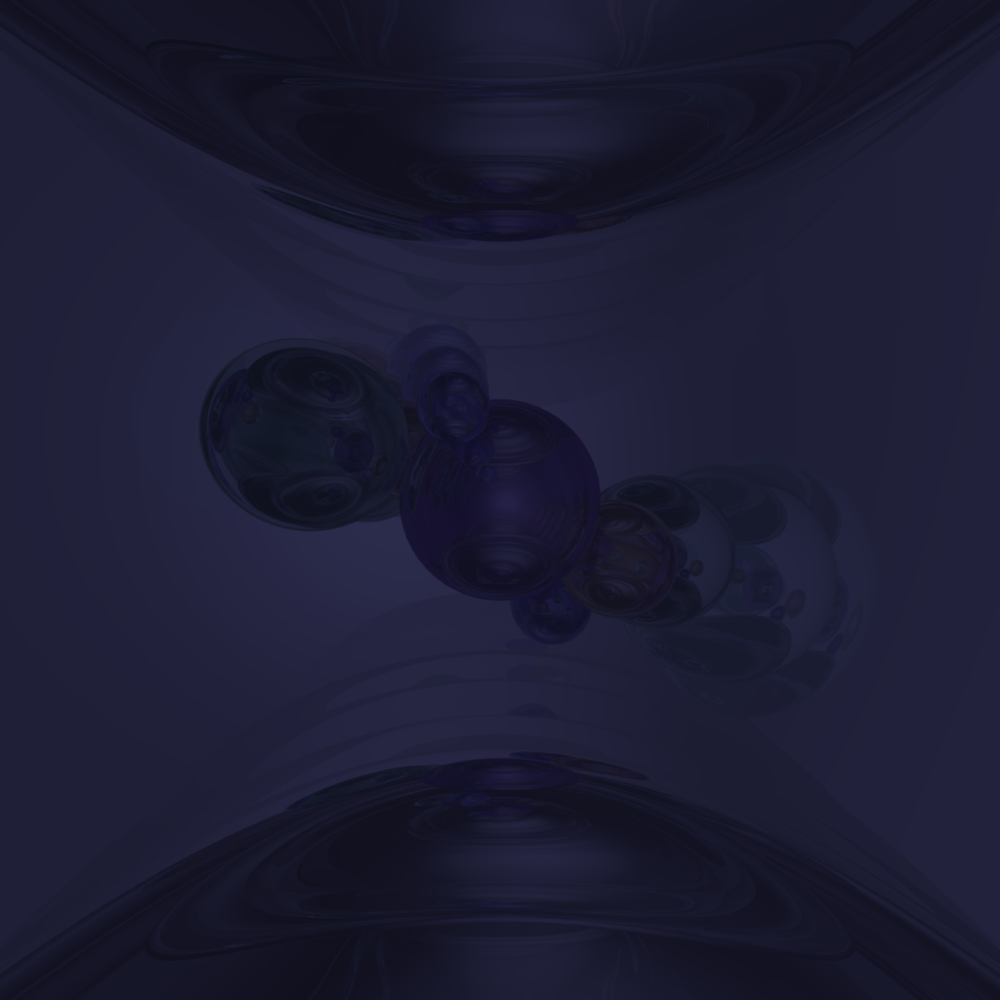
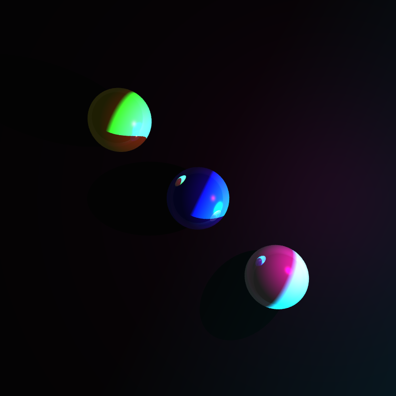
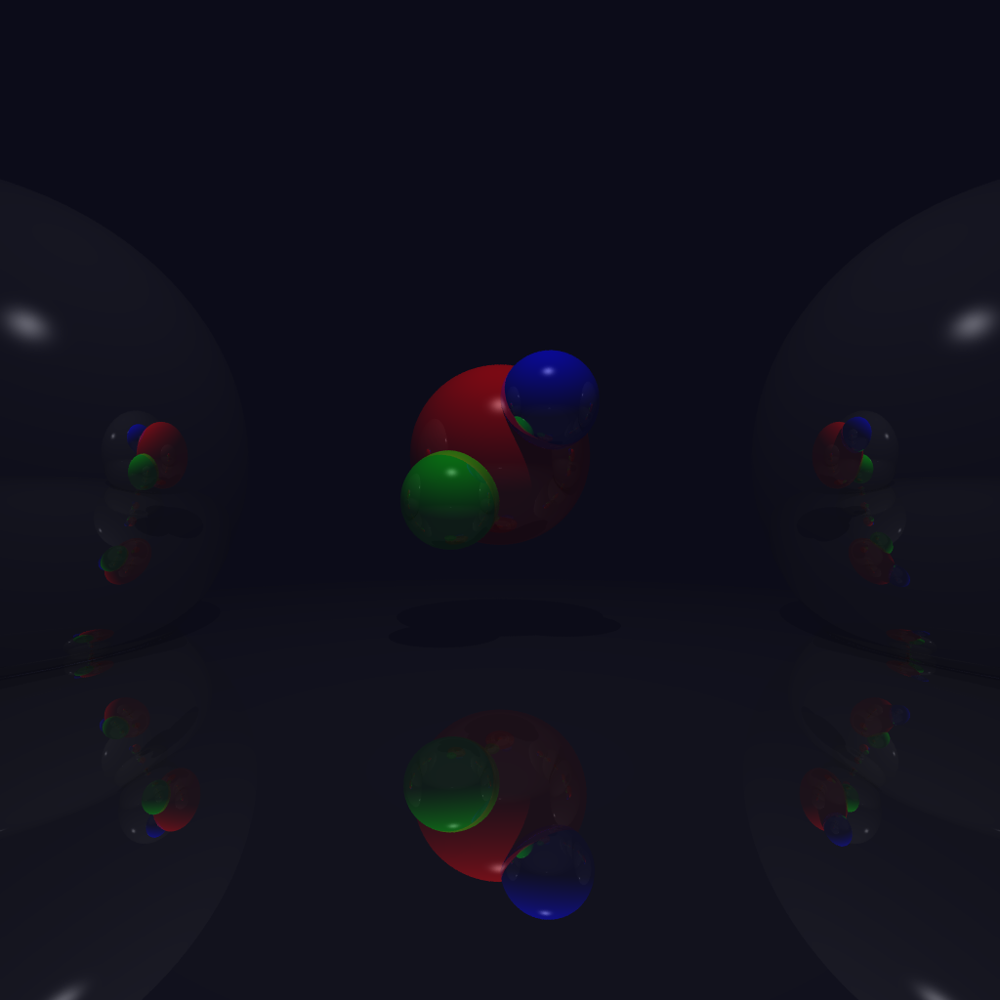
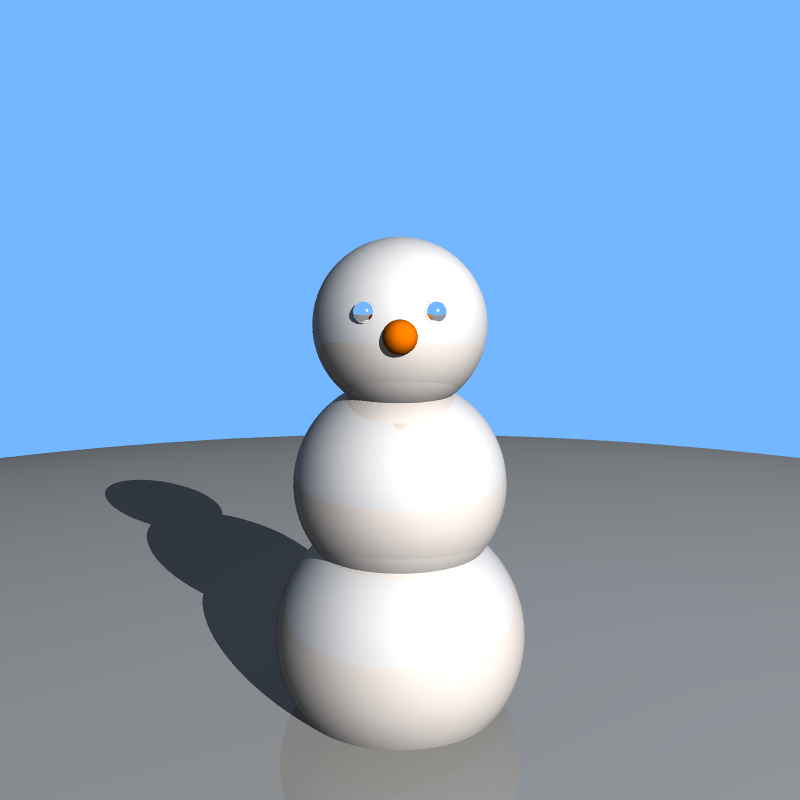
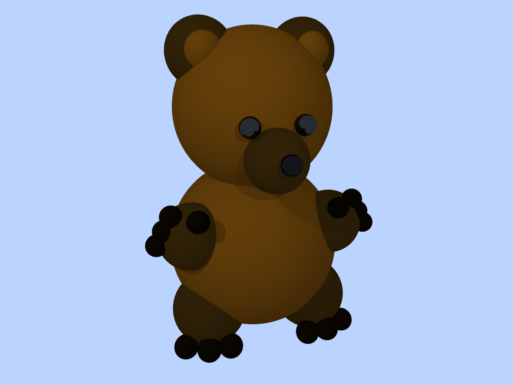

# Ray Tracer (Basic)

This project is a basic CPU ray tracer written in C++. It renders simple 3D scenes by casting a ray through each pixel, finding the closest object intersection, and computing shading using the Phong lighting model.

## Overview

The renderer reads a scene description from a `.txt` file, traces rays into the scene, and generates an output image based on object geometry, material properties, and light sources.

This version focuses on the core ray tracing pipeline and serves as the foundation for the more advanced version of the project.

## Features

- Ray casting per pixel
- Sphere intersection
- Phong shading
  - Ambient
  - Diffuse
  - Specular
- Multiple light support
- Shadow rays
- Scene parsing from `.txt` files
- Image output

### Sample Render
<div align="center">
  
  
  
  
  
</div>

## How It Works

For each pixel, the program:

1. Casts a ray from the camera into the scene
2. Checks intersections against scene objects
3. Finds the nearest valid hit
4. Computes lighting using the surface normal, light direction, and view direction
5. Applies shading and writes the final color to the output image

## Build

Compile the program with:

```bash
g++ -std=c++11 rayTrace.cpp -o raytracer
```

## Run

Run the program by passing a scene file:

```bash
./raytracer ./scenes/bear.txt
```

Other example scene files can be used the same way

## Main Files

- `rayTrace.cpp` - main ray tracing implementation
- `vec3.h` - vector math utilities
- `parse_vec3.h` - scene file parsing
- `scene_structs.h` - scene data structures
- `image_lib.h` - image handling helpers
- `stb_image.h`, `stb_image_write.h` - image loading and writing utilities

## Notes
- Render time depends on the complexity of the scene
- This project focuses on core rendering fundamentals rather than real-time performance

## Challenges

Some of the main challenges in this project included:

- Setting up the camera and image plane correctly
- Debugging scene parsing issues
- Getting shadows and lighting to behave consistently
- Managing intersections and selecting the closest valid hit

## Context

Built as part of a Computer Graphics course project focused on understanding the fundamentals of ray tracing and lighting.
